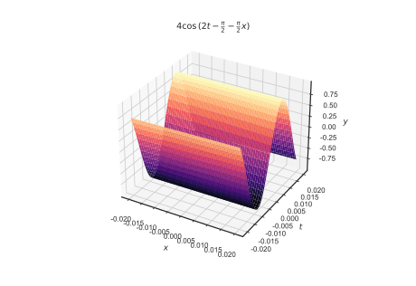
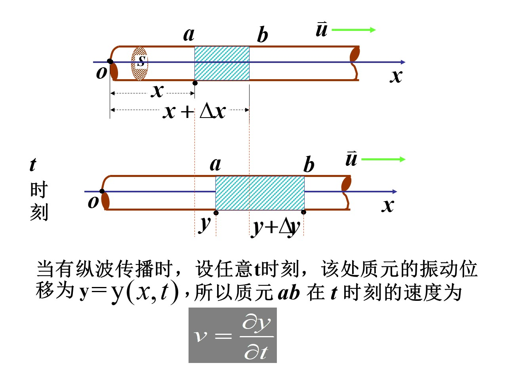
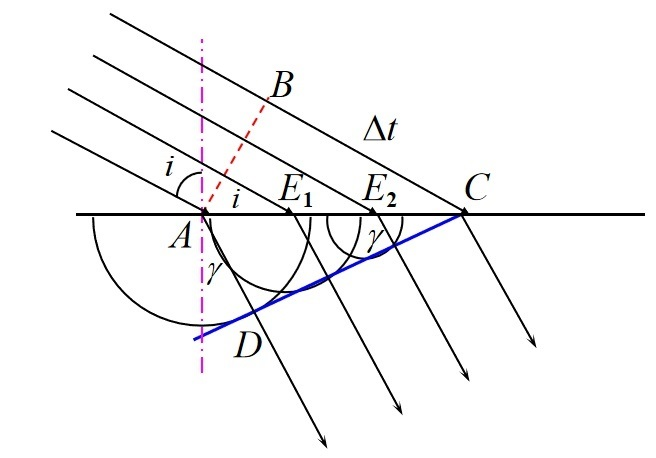

# 波动形变
|   符号    | 名称 | 含义                                                |
| :-------: | :--: | --------------------------------------------------- |
|    $v$    | 频率 | 单位时间传过媒质中某点的波的个数                    |
| $\lambda$ | 波长 | 波的传播方向上振动状态完全相同的 相邻两个点间的距离 |
|    $u$    | 波速 | 单位时间波所传过的距离                              |

波动曲线

## 长变

$$
\frac FS=Y\frac{\Delta l}l
$$
$$
\frac FS:应力
$$
$$
\frac{\Delta l}l:应变
$$
$$
Y:关于长度的比例系数,\,与材料相关,\,杨氏模量
$$
## 切变

$$
\frac FS=N\phi=N\frac dD
$$
$$
\frac FS:应力
$$
$$
\frac dD:应变
$$
$$
N:切变弹性模量
$$
## 体变

$$
\Delta P=-B\frac{\Delta V}V
$$
$$
B:体变弹性模量
$$

## 一维简谐波的表达式
$$
\frac{\partial^2\xi}{\partial t^2}=u^2\frac{\partial^2\xi}{\partial x^2}
$$
$$
y(x,\,t)=A\cos{(\omega t+\varphi_0-\frac{2\pi}\lambda x)}
$$
$$
k=\frac{2\pi}\lambda=\frac\omega u,\,称为角波数
$$

## 球面波
$$
y(r,\,t)=(\frac{A_0r_0}{r})\cos{(\omega t-kr+\varphi_0)}
$$

## 例题

1. 一波源作简谐振动，周期$T=0.01s$，以过平衡位置向正方向运动的时刻作为计时起点，设此振动以$V=400\,\mbox{m/s}$的速度沿直线传播。

   求：

   * 这波动沿某一方向的波动方程；
   * 距波源$16m$处质点的振动方程和初相；
   * 同一波线上距波源为$15m$和$16m$的两点的位相差是多少？
   
   解：
   $$
   \omega=\frac{2\pi}T=200\pi\,\mbox{rad/s},\quad
   k=\frac\omega V=\frac\pi2,\quad
   \varphi_0=-\frac{\pi}2
   $$
   $$
   y(x,\,t)=A\cos{(200t-\frac\pi2-\frac\pi2x)}
   $$
   把$x=16\,\mbox m$代入方程
   $$
   y(t)=A\cos{(200t-\frac{17\pi}2)}
   $$
   $$
   \varphi_{16}=-\frac{17\pi}2
   $$
   把$x=15\,\mbox m$代入方程
   $$
   y(t)=A\cos{(200t-8\pi)}
   $$
   $$
   \Delta \varphi=\varphi_{15}-\varphi_{16}=\frac\pi2
   $$
   $$
   或\Delta \varphi=\frac{2\pi}\lambda\delta=\frac{2\pi}{uT}\delta=\frac\pi2
   $$
   
   

# 波的能量

## 动能密度

质元$ab$的体积：$\Delta V=S\Delta x$

质元$ab$的质量：$\Delta m=\rho\Delta V$

质元$ab$的动能：$dW_k=\dfrac12{dm}v^2=\dfrac12\rho Sdx\left(\dfrac{\partial y}{\partial t}\right)^2$

动能密度：$w_k=\dfrac{dW}{dV}=\dfrac12\rho\left(\dfrac{\partial y}{\partial t}\right)^2$

质元$ab$的势能：
$$
\begin{aligned}
dW_p&=\frac12k(dy)^2=\frac12\frac{YS}{dx}(dy)^2\\
&=\frac12YS\left(\frac{dy}{dx}\right)^2dx\\[1em]
k&=\frac{dF}{dy}=\frac{\frac{dF}{S}}{\frac{dy}{dx}}\cdot\frac S{dx}\\
&=\frac{YS}{dx}
\end{aligned}
$$
势能密度：$w_p=\dfrac{dW_p}{Sdx}=\dfrac12Y\left(\dfrac{\partial y}{\partial x}\right)^2$

$u=\sqrt{\dfrac{Y}{\rho}}$

==能量密度：==
$$
\begin{aligned}
w&=w_k+w_p\\
&=\frac12\rho\left(\frac{\partial y}{\partial t}\right)^2+\frac12\rho u^2\left(\frac{\partial y}{\partial x}\right)^2
\end{aligned}
$$
介质的某区域$V$的总能量：
$$
W=\int_Vw\,dV=\int_V\left[\frac12\rho\left(\frac{\partial y}{\partial t}\right)^2+\frac12\rho u^2\left(\frac{\partial y}{\partial x}\right)^2\right]\,dV
$$
## 平面简谐波的能量密度
$$
w_k=\frac12\rho\omega^2A^2\sin^2{(\omega t-kx+\varphi_0)}
$$
$$
w_p=\frac12\rho\omega^2A^2\sin^2{(\omega t-kt+\varphi_0)}
$$
$$
{\begin{aligned}
w_能&=w_k+w_p\\
&=\rho\omega^2A^2\sin^2{(\omega t-kt+\varphi_0)}
\end{aligned}}
$$
$$
\boldsymbol{\bar w_能=\frac12\rho\omega^2A^2}
$$

## 能流

| 符号     | 含义     |
| -------- | -------- |
| $w_能uS$ | 能流     |
| $u$      | 波长     |
| $S$      | 面积     |
| $w_能u$  | 能流密度 |

### 简谐波的能流密度
$$
w_能u=\rho u\omega^2A^2\sin^2{(\omega t-kx+\varphi_0)}
$$
### 能流密度的平均值
$$
I=\bar w_能u=\frac12\rho u\omega^2A^2
$$

# 惠更斯原理
<u>介质中任一波阵面上的个点，都可以看做是发射子波的波源，其后任一时刻，这些子波的包迹就是新的波阵面</u>

### 波的衍射

波传播过程中当遇到障碍物时,能绕过障碍物的 边缘而传播的现象

<u>当狭缝缩小，与波长相近时，衍射效果显著</u>

### 波的折射

$$
\frac{\sin{i}}{\sin{r}}=\frac{u_1}{u_2}=\frac{n_2}{n_1}=n_{21},
$$
$$
n_{21}为第二种介质相对于第一种介质的相对折射率
$$
当$u_1<u_2\,\mbox{or}\,n_1>n_2\,(当i\ge某值时)\,$时，不满足上式，此时光发生全反射

# 波的叠加 驻波
## 叠加原理适用范围

* 对机械波： 振幅和强度不能太大

  <u>小形变、微振动</u>

* 对电磁波：

  * 光波在真空中传播时，麦克斯韦方程组的四个方程以及本构关系$\vec D=\varepsilon_0\vec E$和$\vec B=\mu_0\vec H$都是线性，其解满足叠加原理
  * 光波在媒质中传播时，若强度不太大（弱光），线性关系成立，满足叠加原理；若强度非常大（强光），非线性光学

|        物理量         |                     表达式                      |
| :-------------------: | :---------------------------------------------: |
|       合振幅$A$       | $\sqrt{A_1^2+A_2^2+2A_1A_2\cos{\Delta\varphi}}$ |
|        强度$I$        |   $I_1+I_2+2\sqrt{I_1I_2}\cos{\Delta\varphi}$   |
| 相位差$\Delta\varphi$ |    $(\varphi_{20}-\varphi_{10})-k(r_2-r_1)$     |

当$\varphi_1=\varphi_2$时，则$\Delta\varphi=-\dfrac{2\pi}{\lambda}\delta$

$$
\begin{cases}
\delta=\pm2k\dfrac\lambda2,\quad k\in\mathbb N,\\
\Longrightarrow A=A_1+A_2\\
\delta=\pm(2k+1)\dfrac\lambda2,\quad k\in\mathbb N,\\
\Longrightarrow A=|A_1-A_2|
\end{cases}
$$

两波源的振动的<u>振幅相近或相等时干涉现象明显</u>

### 例题

1. 两波源$S_1$和$S_2$相距$3m$，其振动表达式分别是$y_{10}=5\cos({\omega t}),\quad y_{20}=5\cos{(\omega t+\pi)}$波长$\lambda=2m$二者振动方向一致。$P$点距两波源$S_1$和$S_2$的距离分别为$4m$和$5m$

   求：$P$点的振幅

   $S_1$和$S_2$分别到$P$点的表达式为：
   $$
   y_1=5\cos{(\omega t-\frac{2\pi}{\lambda}r_1)}=5\cos{(\omega t-4\pi)}
   $$
   $$
   y_2=5\cos{(\omega t-\frac{2\pi}{\lambda}r_2+\pi)}=5\cos{(\omega t-4\pi)}
   $$
   $$
   \Delta \varphi=0
   $$
   $$
   \Longrightarrow A=\sqrt{A_1^2+A_2^2+2A_1A_2\cos{\Delta\varphi}}=10\,\mbox m
   $$

2. 两相干波源$S_1$和$S_2$相距$200m$，位相差为$0$波速$u=400m/s$，频率$v=100Hz$

   设振幅最大的点为$P$，$P$距$S_1$为$a\,m$，距$S_2$为$b\,m$
   $$
   \omega=2\pi v=200\pi\,\mbox{rad/s}
   $$
   $$
   k=\frac\omega u=\frac\pi2\Longrightarrow \lambda=4\,\mbox m
   $$

   $$
   y=A\cos{(200\pi t-\frac\pi2x+\varphi_0)}
   $$
   $$
   \begin{cases}
   a+b=200\\
   a-b=\pm k\lambda,\quad k\in\mathbb N,\\
   0\le a\le 200.
   \end{cases}
   $$
   
   解得：
   $$
   a=100\pm2k,\quad k\in\mathbb N
   $$
   
   $$
   -50\le k\le50
   $$

## 驻波
### 波节和波腹

* 驻波波形不传播
* 驻波相位不传播
* 驻波的能量不传播

$$
y_1=A\cos{(\omega t-kx+\varphi_{10})}
$$
$$
y_2A\cos{(\omega t+kx+\varphi_{20})}
$$

$$
\begin{aligned}
y=&y_1+y_2\\
=&2A\cos{(kx+\dfrac{\varphi_{20}-\varphi_{10}}2)}
\cos{(\omega t+\dfrac{\varphi_{20}+\varphi_{10}}2)}
\end{aligned}
$$

### 驻波的能量

$$
y=2A\cos{(kx+\dfrac{\varphi_{20}-\varphi_{10}}2)}
\cos{(\omega t+\dfrac{\varphi_{20}+\varphi_{10}}2)}
$$
#### 动能密度
$$
\begin{aligned}
w_k=&\dfrac12\rho(\frac{\partial y}{\partial x})^2\\
=&2\rho\omega^2A^2\cos^2{(kx+\dfrac{\varphi_{20}-\varphi_{10}}2)}\sin^2{(\omega t+\dfrac{\varphi_{20}+\varphi_{10}}2)}
\end{aligned}
$$
#### 势能密度
$$
\begin{aligned}
w_p=&\dfrac12\rho u^2(\dfrac{\partial y}{\partial x})^2\\
=&2\rho\omega^2A^2\sin^2{(kx+\dfrac{\varphi_{20}-\varphi_{10}}2)}\cos^2{(\omega t+\dfrac{\varphi_{20}+\varphi_{10}}2)}
\end{aligned}
$$

#### 一段内的总能量
$$
\int_0^\frac\lambda2 wdx=\frac12\rho A^2\omega^2\lambda
$$

<u>动能最大，势能等于零；动能等于零，势能最大。 任一时刻，波节的动能始终为零；波腹的势能密 度始终为零</u>

**能量局限在每一段中，相互转化， 在驻波的进行过程中没有能量的传播**

#### 半波损失
